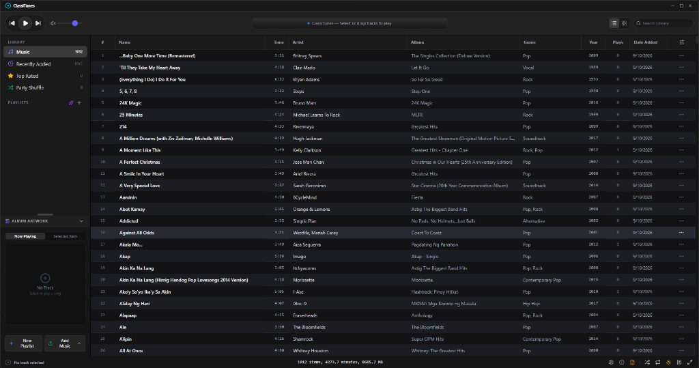

<div align="center">
  
  <h1>ClassiTunes</h1>
  <p><strong>A nostalgic, high-performance desktop music player and metadata organizer</strong></p>
  <p>Engineered with React 19, TypeScript, Vite, Tailwind CSS, Tauri v2, and Electron.</p>

  <p>
    <a href="#key-features">Features</a> •
    <a href="#installation--running">Installation</a> •
    <a href="#supported-audio-formats">Formats</a> •
    <a href="#development--building">Development</a> •
    <a href="#keyboard-shortcuts">Shortcuts</a> •
    <a href="#privacy--security">Security</a> •
    <a href="#license">License</a>
  </p>

  <br />
  
</div>

---

## Overview

**ClassiTunes** brings the golden era of classic desktop jukeboxes into the modern era. Combining the beloved, clean aesthetic of classic brushed metal and dark interface styling with high-performance native desktop capabilities, ClassiTunes offers local library indexing, gapless audio playback, a 10-band graphic equalizer, physical metadata tagging, and smart playlist automation.

Available as a native desktop application powered by **Tauri v2** (ultra-lightweight Rust backend) and **Electron**, as well as a standalone web jukebox.

---

## Key Features

### 🎵 High-Fidelity Audio Engine
- **Cross-Platform Playback:** Gapless audio pipeline with high-precision seeking, customizable volume curve, shuffle, and single/all repeat modes.
- **Audio Normalization:** Consistent perceived loudness across diverse tracks and masters.
- **Adjustable Crossfading:** Seamless track transitions with configurable 1–12 second crossfade durations.
- **10-Band Graphic Equalizer:** 32 Hz to 16 kHz frequency control with pre-amp gain and 17 handcrafted presets (*Acoustic*, *Bass Booster*, *Rock*, *Classical*, *Electronic*, *Jazz*, *Vocal Booster*, and more).
- **Interactive Visualizers:** Real-time audio spectrum analysis featuring *Classic Bars*, *Laser Wave*, *Frequency Ring*, and *Cosmic Particles*.

### 🏷️ Native Metadata & Tag Editor ("Get Info")
- **Inspect & Edit Full ID3 & MP4 Metadata:** Modify Title, Artist, Album Artist, Album, Composer, Publisher, Year, Track Number & Total, Disc Number & Total, BPM, Genre, Media Kind, and Comments.
- **Direct Physical Tag Writing:** 
  - **MP3 & ADTS AAC:** ID3v2 tagging with embedded JPEG/PNG album art support.
  - **M4A, M4B, MP4:** Native MP4 `ilst` atom tagging via Rust `mp4ameta`.
- **Embedded Artwork Manager:** Extract, replace, paste, preview, or remove embedded track album art.
- **Lyrics Inspector:** Embedded synchronized and unsynchronized lyrics viewer and editor.
- **AI Track Insights:** Optional Google Gemini AI integration to summarize song lyrics, explore artist discography, and suggest complementary tracks.

### 📁 Library Management & Smart Playlists
- **Multiple Browsing Modes:** Switch smoothly between **Detailed List View** (with sortable columns, star ratings, play counts) and **Album Grid View** with high-resolution artwork cards.
- **Smart Rule-Based Playlists:** Create automated playlists matching "All" or "Any" conditions across artists, genres, star ratings, years, play counts, or custom keywords (e.g., *Top Rated Songs*, *90s Rock Favorites*).
- **Disk Auto-Organizer:** Automatically organize audio files into standard hierarchical directories:
  ```
  <Music Directory>/<Artist>/<Album>/<Title> - <Artist>.<ext>
  ```
- **Instant Search & Multi-Column Sorting:** Filter across thousands of tracks with sub-millisecond responsiveness.
- **Drag & Drop Import:** Drag music files or entire folder trees directly into the library window.

### 🖥️ Native Desktop Experience & Theming
- **Dual Runtimes:** First-class support for both **Tauri v2** (low memory footprint, fast startup) and **Electron**.
- **Brushed Light & Sleek Dark Themes:** Nostalgic brushed platinum interface alongside a modern low-fatigue dark studio theme.
- **Window State Persistence:** Automatically remembers window dimensions, positions, and maximized states across sessions.
- **Diagnostics & Scan Logs:** Built-in logging panel to monitor directory imports, metadata extraction, and system status.

---

## Supported Audio Formats

| Format | Extensions | Metadata Tagging | Cover Art Extraction |
| :--- | :--- | :---: | :---: |
| **MPEG Audio Layer III** | `.mp3` | ID3v2.3 / ID3v2.4 | ✅ |
| **Advanced Audio Coding** | `.m4a`, `.aac`, `.mp4` | MP4 `ilst` / ID3 | ✅ |
| **Free Lossless Audio Codec** | `.flac` | Vorbis Comment | ✅ |
| **Waveform Audio** | `.wav` | ID3 / RIFF INFO | ✅ |
| **Ogg Vorbis** | `.ogg` | Vorbis Comment | ✅ |
| **Apple Lossless** | `.alac`, `.m4a` | MP4 `ilst` | ✅ |
| **Audio Interchange Format** | `.aiff`, `.aif` | ID3 | ✅ |
| **Windows Media Audio** | `.wma` | ASF Tags | ✅ |

---

## Installation & Running

### Windows

#### 1. Installer or Portable Binary
1. Download `ClassiTunes Setup <version>.exe` or `ClassiTunes-portable.exe` from the GitHub Releases page.
2. Run the executable and follow the setup prompt.

> [!NOTE]
> **Windows SmartScreen Prompt:**  
> Because ClassiTunes is an independent open-source project without a commercial EV certificate, Windows Defender SmartScreen may show:  
> *"Windows protected your PC — Microsoft Defender SmartScreen prevented an unrecognized app from starting."*  
> To launch: Click **More info** $\rightarrow$ **Run anyway**.

---

### macOS

#### 1. DMG Disk Image
1. Download `ClassiTunes-<version>.dmg` from the Releases page.
2. Open the `.dmg` image and drag **ClassiTunes** into your `/Applications` directory.
3. Launch **ClassiTunes** from Spotlight or Launchpad.

> [!NOTE]
> **macOS Gatekeeper First-Time Notice:**  
> If macOS alerts that the app cannot be verified:  
> 1. In **Finder**, go to `/Applications`.  
> 2. **Right-click (or Control-click)** `ClassiTunes` and choose **Open**.  
> 3. Click **Open** in the confirmation box.  
> 
> *Alternatively via Terminal:*
> ```bash
> xattr -cr /Applications/ClassiTunes.app
> ```

---

### Linux

#### AppImage
```bash
chmod +x ClassiTunes-*.AppImage
./ClassiTunes-*.AppImage
```

#### Debian / Ubuntu Package (`.deb`)
```bash
sudo dpkg -i ClassiTunes_*_amd64.deb
sudo apt-get install -f # Fix missing dependencies if required
```

> [!TIP]
> **Linux Audio Codec Support:**  
> Ensure GStreamer audio decoders are available for proprietary formats (MP3/AAC):
> - **Ubuntu / Debian / Mint:** `sudo apt install -y gstreamer1.0-plugins-base gstreamer1.0-plugins-good gstreamer1.0-plugins-bad gstreamer1.0-libav`
> - **Fedora:** `sudo dnf install -y gstreamer1-plugins-good gstreamer1-plugins-bad-free`
> - **Arch Linux:** `sudo pacman -S --needed gst-plugins-good gst-plugins-bad gst-libav`

---

## Development & Building

### Prerequisites
- [Node.js](https://nodejs.org/) (v20 or higher recommended)
- [Rust & Cargo](https://rustup.rs/) (required for the Tauri backend)
- C++ Build Tools (e.g. Visual Studio C++ Build Tools on Windows, Xcode CLI tools on macOS, build-essential on Linux)

### 1. Clone & Install
```bash
git clone https://github.com/zsoftwarelabs/classitunes.git
cd classitunes
npm install
```

### 2. Environment Configuration (Optional)
If you want to use the Google Gemini song analysis feature:
```bash
cp .env.example .env.local
```
Add your API key:
```env
GEMINI_API_KEY="your-gemini-api-key-here"
```

### 3. Development Commands

| Command | Description |
| :--- | :--- |
| `npm run dev` | Starts the Vite web development server (`http://localhost:3000`) |
| `npm run tauri:dev` | Launches the Tauri native desktop app in dev mode |
| `npm run electron:dev` | Launches the Electron desktop app concurrently with Vite |
| `npm run lint` | Runs TypeScript compilation checks (`tsc --noEmit`) |

### 4. Production Packaging

```bash
# Build Tauri desktop bundle (Windows NSIS/MSI, macOS DMG, Linux AppImage/deb)
npm run tauri:build

# Build Electron production package
npm run electron:build
```
Build artifacts will be located in:
- Tauri: `src-tauri/target/release/bundle/`
- Electron: `dist-electron/`

---

## Keyboard Shortcuts

| Shortcut | Action |
| :--- | :--- |
| <kbd>Space</kbd> | Play / Pause active track |
| <kbd>Ctrl</kbd> + <kbd>→</kbd> / <kbd>Cmd</kbd> + <kbd>→</kbd> | Next track |
| <kbd>Ctrl</kbd> + <kbd>←</kbd> / <kbd>Cmd</kbd> + <kbd>←</kbd> | Previous track |
| <kbd>Ctrl</kbd> + <kbd>↑</kbd> / <kbd>Cmd</kbd> + <kbd>↑</kbd> | Volume up (+5%) |
| <kbd>Ctrl</kbd> + <kbd>↓</kbd> / <kbd>Cmd</kbd> + <kbd>↓</kbd> | Volume down (-5%) |
| <kbd>Ctrl</kbd> + <kbd>I</kbd> / <kbd>Cmd</kbd> + <kbd>I</kbd> | Open "Get Info" dialog for selected track |
| <kbd>Ctrl</kbd> + <kbd>F</kbd> / <kbd>Cmd</kbd> + <kbd>F</kbd> | Focus library search bar |
| <kbd>Ctrl</kbd> + <kbd>N</kbd> / <kbd>Cmd</kbd> + <kbd>N</kbd> | Create new standard playlist |
| <kbd>Ctrl</kbd> + <kbd>Shift</kbd> + <kbd>N</kbd> | Create new smart playlist |
| <kbd>Ctrl</kbd> + <kbd>,</kbd> / <kbd>Cmd</kbd> + <kbd>,</kbd> | Open Settings & Preferences |
| <kbd>Esc</kbd> | Close active modal dialog |

---

## Privacy & Security

- **100% Offline & Local by Default:** Your music files, metadata, play history, ratings, and artwork remain strictly on your local disk.
- **Zero Third-Party Telemetry:** No tracking, analytics beaconing, or advertising identifiers.
- **Auditable & Open:** Built transparently with open-source dependencies and permissive licensing.

---

## Contributing

Contributions, bug reports, and suggestions are welcome!
1. Fork the repository.
2. Create your feature branch (`git checkout -b feature/amazing-feature`).
3. Commit your changes (`git commit -m 'Add amazing feature'`).
4. Push to the branch (`git push origin feature/amazing-feature`).
5. Open a Pull Request.

---

## License

Distributed under the **MIT License**. See [LICENSE.md](LICENSE.md) for full details.

Copyright © 2026 **Z Software Labs**. All rights reserved.
